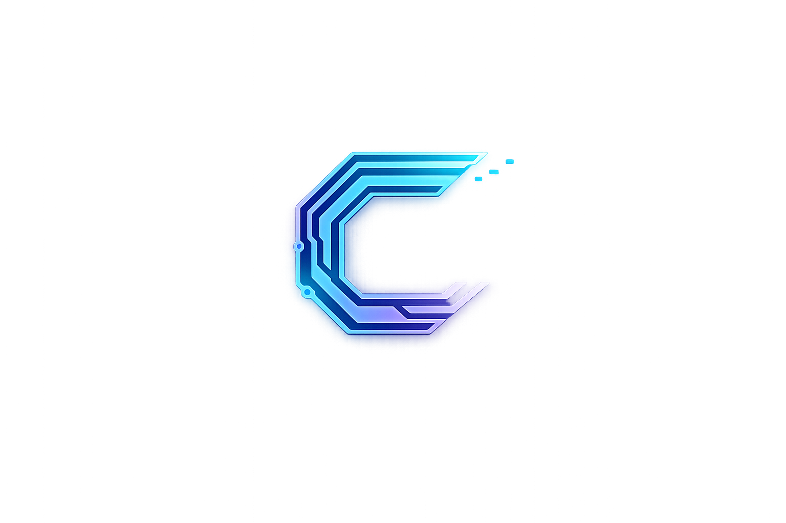

  

  
  
  
  

<h1 align="center">💼 Christopher Benini - Portfolio</h1>

  Portfólio profissional desenvolvido para apresentar um pouco de mim e meus pojetos.

---

## 🖥️ Preview (Desktop)

  

---

## 📱 Responsividade (Mobile)

O site foi desenvolvido com layout responsivo, se adaptando para **Desktop** e **Mobile**, com ajustes específicos de tipografia, espaçamento e posicionamento.

  

---

## ✨ Sobre o Projeto

Este portfólio foi criado para transmitir uma identidade visual tecnológica e moderna, com foco em:

- Interatividade e fluidez
- Organização de layout
- Responsividade real
- Experiência visual

---

## 🛠 Tecnologias Utilizadas

- HTML5 (estrutura semântica)
- CSS3 (layout, responsividade e animações)
- JavaScript Vanilla (interações e lógica)
- Canvas API (background dinâmico)
- Efeito de digitação (typewriter)
- Modal + filtros de projetos

---

## 🎯 Objetivo

Projeto desenvolvido como parte da minha apresentação profissional para oportunidades nas áreas apresentadas.

---

## 👨‍💻 Autor

**Christopher Benini**  
🔗 LinkedIn: https://www.linkedin.com/in/christopher-benini-081b7833a/  
