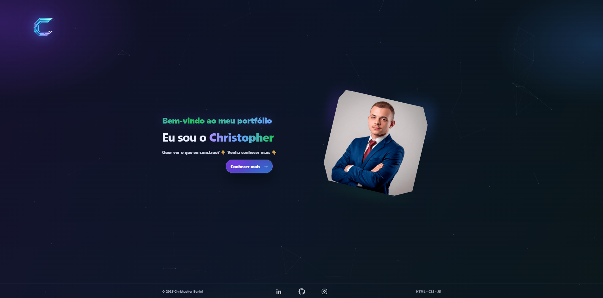

  
  
  
  

<h1 align="center">💼 Christopher Benini - Portfolio</h1>

  

  

---

## ✨ Sobre o Projeto

Este é meu portfólio profissional desenvolvido para apresentar minhas habilidades em desenvolvimento web, organização de código e construção de interfaces modernas.

O projeto foi pensado para transmitir:

- Identidade visual tecnológica
- Interatividade
- Código estruturado
- Responsividade real
- Experiência fluida

🔗 **Acesse online:** _(coloque aqui seu link da Netlify/Vercel depois)_

---

## 🛠 Tecnologias Utilizadas

### 🌐 Front-end
- HTML5 (estrutura semântica)
- CSS3 (layout, responsividade, animações)
- JavaScript Vanilla (interações e lógica)

### 🎨 Interface & Experiência
- Animação Typewriter (efeito de digitação)
- Gradients dinâmicos
- Background com Canvas API
- Sistema de filtro de projetos
- Modal interativo
- Layout adaptado para Desktop e Mobile
- Media Queries customizadas

### 🧠 Conceitos Aplicados
- Separação de responsabilidades
- Estrutura modular de arquivos
- Manipulação de DOM
- Organização de assets
- Versionamento com Git

---

## 📱 Responsividade

O layout foi construído pensando em:

- Desktop
- Tablets
- Mobile

Com ajustes específicos de tipografia, espaçamento e posicionamento de elementos para cada breakpoint.

---

## 🎯 Funcionalidades Principais

✔ Header com efeito de digitação  
✔ Hero section com identidade visual forte  
✔ Fundo animado utilizando Canvas  
✔ Sistema de filtro de projetos  
✔ Modal dinâmico para detalhes  
✔ Estrutura separada para desktop e mobile  
✔ Código organizado e comentado  

---

## 🚀 Objetivo

Este projeto foi desenvolvido como parte da minha apresentação profissional para oportunidades na área de desenvolvimento web.

Ele representa minha evolução técnica e atenção aos detalhes.

---

## 👨‍💻 Autor

**Christopher Benini**  
Desenvolvedor Front-End  

[LinkedIn](#) • [GitHub](https://github.com/chrisbenini)

---

  ⚡ Sempre buscando evoluir, construir e aprender.

