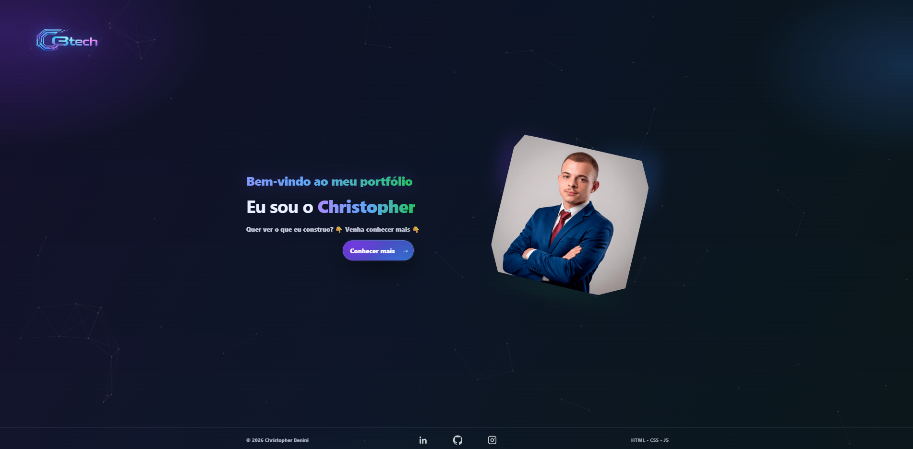
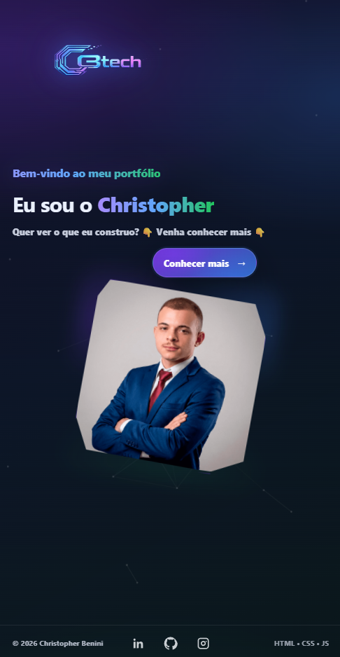

<p align="center">
  
</p>

<h1 align="center">Christopher Benini — Portfolio</h1>

<p align="center">
  Interface moderna, responsiva e interativa construída com foco em experiência visual e organização técnica.
</p>

<p align="center">
  
  
  
  
  
</p>

---

# 🖥 Preview — Desktop

<p align="center">
  
</p>

---

# 📱 Responsividade — Mobile

Layout adaptativo com ajustes específicos de:

- Escala tipográfica  
- Espaçamento  
- Estrutura de navegação  
- Experiência visual fluida  

<p align="center">
  
</p>

---

# ✨ Visão do Projeto

Este portfólio foi projetado como uma aplicação front-end moderna com foco em:

- Identidade visual tecnológica
- Performance visual
- Separação clara de responsabilidades
- Estrutura modular
- Experiência imersiva

O objetivo foi ir além de um simples “site estático”, criando uma interface dinâmica com microinterações e animações personalizadas.

---

## 🏗 Arquitetura

```text
Portfolio/
│
├── 📄 index.html
├── 📄 principal.html
├── 📄 projetos.html
│
├── 🎨 css/
│   ├── estilos.css
│   └── estilos-mobile.css
│
├── ⚙️ js/
│   ├── funcoes.js
│   ├── projetos.js
│   └── rede-home.js
│
└── 📦 recursos/
```

### Conceitos aplicados:

- HTML semântico
- CSS modularizado
- Breakpoints específicos
- Manipulação dinâmica do DOM
- Canvas API para background animado
- Sistema de filtros + modal dinâmico
- Efeito typewriter customizado
- Separação Desktop / Mobile

---

# 🛠 Stack Técnica

### Front-End
- HTML5
- CSS3 (Flexbox, Media Queries, Animations)
- JavaScript ES6

### Interatividade
- Canvas API
- DOM manipulation
- Dynamic content rendering
- Custom UI effects

### Estrutura
- Organização modular
- Separação de responsabilidades
- Versionamento com Git

---

# 🎯 Decisões Técnicas

✔ Sem frameworks para manter controle total da estrutura  
✔ Responsividade manual para maior precisão visual  
✔ Animações leves para preservar performance  
✔ Estrutura preparada para possível futura migração para framework  

---

# 🚀 Live Preview

<p align="center">
  <a href="https://portfolio-chrisbenini.netlify.app" target="_blank">
    
  </a>
</p>

---

# 👨‍💻 Autor

Christopher Benini  

LinkedIn:  
https://www.linkedin.com/in/christopher-benini-081b7833a/

---

<p align="center">
  ⭐ Se você gostou do projeto, considere dar um Star.
</p>
