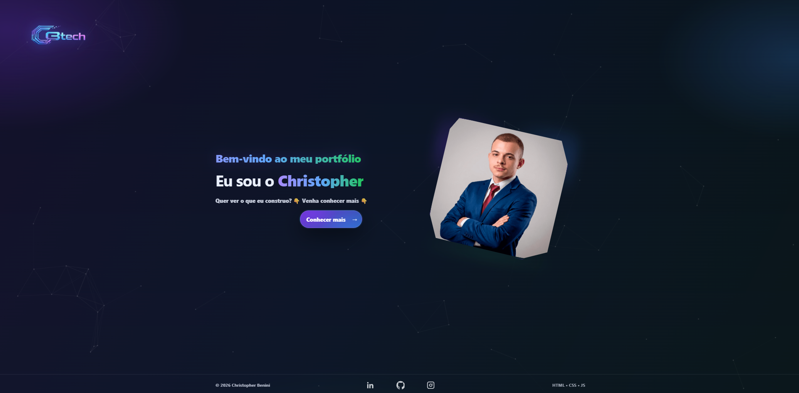
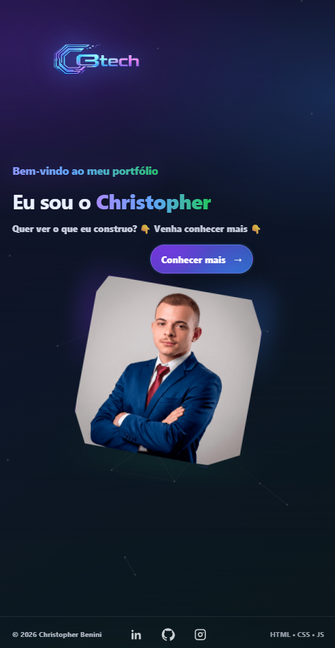

<p align="center">
  
</p>

<p align="center">
  Projeto de <b>portfólio front-end</b> desenvolvido com foco em <b>identidade visual, interatividade, responsividade e organização técnica</b>, criando uma experiência moderna para apresentação de projetos e posicionamento profissional.
</p>

<p align="center">
  <a href="https://portfolio-chrisbenini.netlify.app" target="_blank">
    
  </a>
  <a href="https://github.com/chrisbenini/Portfolio" target="_blank">
    
  </a>
  
</p>

<p align="center">
  
  
  
  
  
  
</p>

---

## `> overview`

Este projeto foi construído como uma aplicação front-end moderna para representar minha identidade profissional de forma mais visual, técnica e memorável.

A proposta foi ir além de um portfólio estático, desenvolvendo uma interface com:

- visual tecnológico
- navegação fluida
- responsividade manual
- microinterações
- animações customizadas
- organização modular de arquivos

O resultado é uma experiência voltada tanto para **recrutadores** quanto para **desenvolvedores**, combinando apresentação profissional com execução técnica bem estruturada.

---

## `> live_project`

<p align="center">
  <a href="https://portfolio-chrisbenini.netlify.app" target="_blank">
    
  </a>
</p>

---

## `> desktop_preview`

<p align="center">
  
</p>

---

## `> mobile_responsiveness`

O layout foi adaptado para diferentes resoluções com ajustes específicos em:

- escala tipográfica
- espaçamento entre blocos
- organização do conteúdo
- navegação
- fluidez da experiência visual

<p align="center">
  
</p>

---

## `> project_vision`

Este portfólio foi pensado como uma interface com foco em:

- identidade visual tecnológica
- performance visual
- clareza na apresentação dos projetos
- separação bem definida de responsabilidades
- experiência mais imersiva para o usuário

O objetivo foi criar uma aplicação que demonstrasse não apenas conteúdo, mas também **cuidado com arquitetura, design e experiência de uso**.

---

## `> technical_highlights`

### Principais destaques da implementação

- layout responsivo com adaptação manual
- background animado com **Canvas API**
- efeito de digitação personalizado
- organização modular de CSS e JavaScript
- renderização dinâmica de conteúdo
- sistema de filtros para projetos
- modal dinâmico para exibição detalhada
- separação entre lógica, estilo e estrutura
- foco em legibilidade e experiência visual

---

## `> architecture`

```text
Portfolio/
│
├── index.html
├── principal.html
├── projetos.html
│
├── css/
│   ├── estilos.css
│   └── estilos-mobile.css
│
├── js/
│   ├── funcoes.js
│   ├── projetos.js
│   └── rede-home.js
│
└── recursos/
```

---

## `> engineering_decisions`

### Estrutura adotada

- **HTML semântico** para melhor organização estrutural
- **CSS modularizado** para separar responsabilidades visuais
- **JavaScript ES6** para interatividade e manipulação da interface
- **Canvas API** para reforçar identidade visual com background animado
- **separação Desktop / Mobile** para maior controle do comportamento responsivo

### Decisões técnicas

- sem frameworks, para manter controle total da estrutura
- responsividade manual, priorizando precisão visual
- animações leves, preservando performance
- base preparada para futuras evoluções ou migração para framework

---

## `> tech_stack`

<p align="center">
  
  
  
  
  
  
  
</p>

<p align="center">
  
  
  
  
  
</p>

---

## `> feature_breakdown`

### Front-End
- HTML5
- CSS3
- JavaScript ES6

### UI / UX
- interface responsiva
- hierarquia visual bem definida
- experiência orientada à navegação
- microinterações personalizadas

### Interatividade
- Canvas API
- manipulação dinâmica do DOM
- modal dinâmico
- renderização de conteúdo
- efeitos visuais customizados

### Estrutura
- organização modular
- separação de responsabilidades
- base escalável para evolução futura

---

## `> why_this_project_matters`

Este projeto representa mais do que uma vitrine visual.

Ele demonstra capacidade de:

- estruturar uma aplicação front-end completa
- tomar decisões visuais e técnicas coerentes
- construir uma interface com identidade própria
- organizar código de forma reutilizável
- equilibrar estética, performance e experiência de uso

Em outras palavras, o portfólio funciona tanto como **apresentação profissional** quanto como **prova prática de execução**.

---

## `> possible_future_improvements`

Algumas evoluções possíveis para versões futuras:

- dark/light mode
- internacionalização
- consumo de dados via API
- refatoração para framework front-end
- animações mais avançadas com biblioteca dedicada
- painel administrativo para atualização de projetos

---

## `> author`

**Christopher Benini**

Desenvolvedor focado em **dados, automação, interfaces e integrações**, com interesse em construir soluções que unam organização técnica, experiência visual e produtividade.

<p align="center">
  <a href="https://github.com/chrisbenini" target="_blank">
    
  </a>
  <a href="https://www.linkedin.com/in/christopher-benini-081b7833a/" target="_blank">
    
  </a>
</p>

---

<p align="center">
  ⭐ Se você gostou do projeto, considere dar um <b>Star</b> no repositório.
</p>
