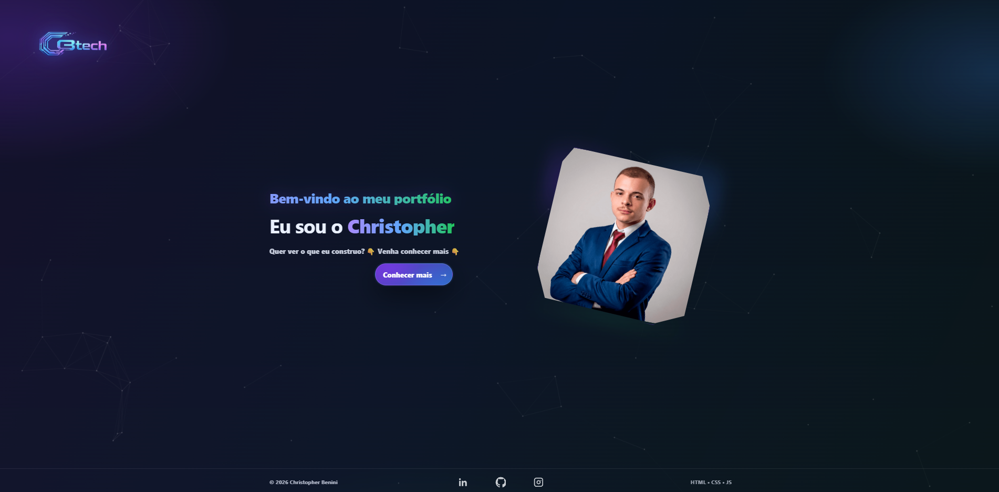
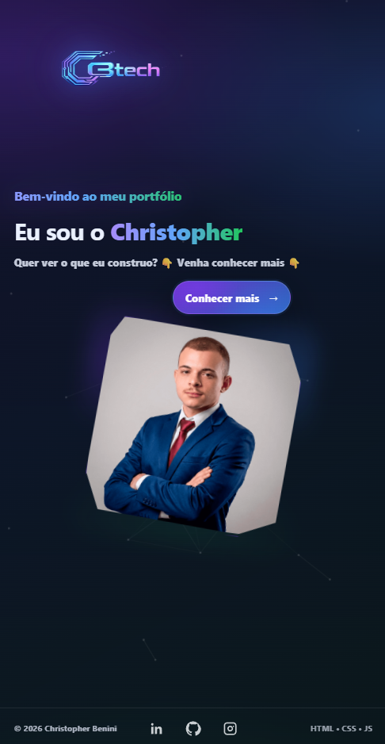

<p align="center">
  
</p>

<p align="center">
Portfólio front-end desenvolvido para apresentar projetos de forma <b>moderna</b>, <b>interativa</b> e <b>responsiva</b>.
</p>

---

## 🚀 Acessar Projeto

<p align="center">
  <a href="https://portfolio-chrisbenini.netlify.app" target="_blank">
    
  </a>
  <a href="https://github.com/chrisbenini/Portfolio" target="_blank">
    
  </a>
</p>

---

## `> what_is_this`

Interface criada para representar minha identidade profissional através de:

✔ design tecnológico  
✔ navegação fluida  
✔ responsividade manual  
✔ animações e microinterações  
✔ organização front-end profissional  

---

## `> main_features`

- layout totalmente responsivo  
- background animado com Canvas API  
- efeito de digitação dinâmico  
- modal interativo para projetos  
- renderização dinâmica de conteúdo  
- separação entre HTML, CSS e JavaScript  

---

## `> preview`

<p align="center">
  
</p>

<p align="center">
  
</p>

---

## `> tech_stack`

<p align="center">


</p>

---

## `> project_structure`

```
Portfolio/
│
├── index.html
├── projetos.html
│
├── css/
├── js/
└── recursos/
```

---

## `> project_goal`

Criar um portfólio que funcione como **apresentação profissional** e também como **demonstração prática de desenvolvimento front-end**, combinando design, organização e experiência do usuário.

---

## `> author`

**Christopher Benini**

<p align="center">
  <a href="https://github.com/chrisbenini">
    
  </a>
  <a href="https://www.linkedin.com/in/christopher-benini-081b7833a/">
    
  </a>
</p>

---

<p align="center">
⭐ Gostou do projeto? Deixe uma estrela!
</p>
